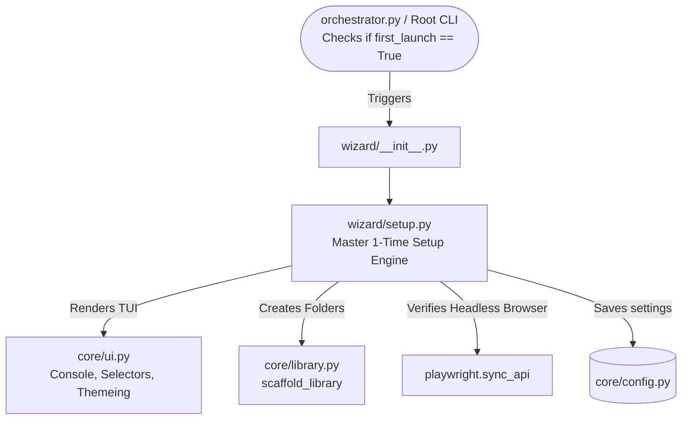

# Wizard Directory
The `wizard` directory contains the initial environment configuration and bootstrapping logic for the scraper suite.

## Folder Structure
- `setup.py`
- `__init__.py`

## File Explanations
* **`setup.py`**: This is a highly complex, interactive 1-Time Setup Wizard built on top of the `rich` framework. It features terminal emulator detection (supporting Kitty, Alacritty, WezTerm, etc.), and renders a beautiful, symmetrical "Configuration Funnel" UI. Notably, it performs a deep audit (`check_all_requirements()`) of system binaries (like `ffmpeg`, `deno`, `aria2c`), Python dependencies, and the Playwright Chromium driver. If dependencies are missing, it blocks setup and provides exact OS-specific terminal commands to fix the environment.

---

## 🔍 Deep Dive Analysis

```text
wizard/
├── README.md
├── __init__.py
└── setup.py
```

### Detailed File Explanations & What Each File Does

#### `__init__.py`
**Overview:**  
This is a standard Python package initialization file.

**Explanation:**  
It is virtually empty (containing only a `# wizard package` comment), but its presence is crucial. It tells the Python interpreter to treat the `wizard` directory as a modular package. This allows external modules (like the main application entry point) to import functions and classes from the files inside this directory (e.g., `from wizard.setup import run_first_launch_setup`).

#### `setup.py`
**Overview:**  
This is the core bootstrapping engine for the Zine Scraper Suite. It handles the initial first-launch configuration, system audits, and dependency verification.

**Explanation:**  
This file defines a highly complex, interactive 1-Time Setup Wizard built on top of the `rich` framework. Its primary responsibilities include:
1. **Terminal & OS Detection:** The `detect_terminal()` function inspects environment variables to determine the specific terminal emulator in use (e.g., Kitty, Alacritty, WezTerm, iTerm2, Windows Terminal) to optimize the TUI rendering.
2. **Visual Presentation:** 
   - `render_setup_tree()` renders a beautiful, symmetrical "Configuration Funnel" UI, visually indicating the current step in the setup process using dynamic, color-coded grids and palette swatches. 
   - `get_welcome_header_renderable()` and `print_welcome_header()` draw an intricate ASCII art tagline header formatted in strict, centered columns.
3. **Interactive TUI Prompts:** 
   - It subclasses `Selector` into `TextInput` and `ThemeSelector`. These customized classes use `rich.live.Live` to capture individual keystrokes in real-time, allowing users to scroll through themes or type paths dynamically without flooding or clearing the terminal history unnecessarily.
4. **Deep System Audit:** `check_all_requirements()` performs an extensive validation of the environment. It checks for:
   - System binaries like `ffmpeg` (critical), `deno`/`node` (optional), and `aria2c` (optional).
   - A suite of Python dependencies (e.g., `rich`, `requests`, `bs4`, `yt_dlp`, `playwright`, `Crypto`).
   - The Playwright Chromium driver via dynamic import and execution path checking.
5. **Enforced Remediation:** `verify_system_requirements()` presents the audit results in a clean table. If any critical dependencies are missing, it blocks setup progression and generates exact, OS-specific terminal commands (for Windows, macOS, and Linux variants) guiding the user to fix their environment.
6. **Main Setup Flow (`run_first_launch_setup`):** This is the master orchestrator. It prompts the user for three key configurations:
   - **Library Root Path:** Suggests an OS-appropriate default, validates the input path, creates the directory, and calls `scaffold_library()` to build the necessary subfolders.
   - **Color Theme:** Provides a two-page selection UI (Classic vs. Soothing themes) dynamically updating the terminal colors as the user scrolls.
   - **Chapter Delay:** Ensures a valid float number is configured to prevent rate-limiting during downloads.
   After collecting these inputs, it marks the application as launched (`config.mark_launched()`) to persist the settings, preventing the wizard from running on subsequent executions.

### Web-Like Structure & Dependencies


